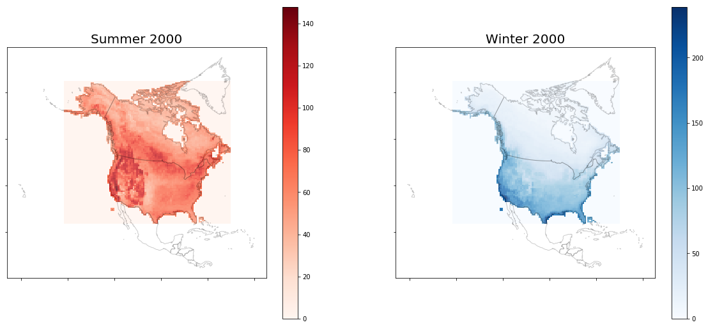
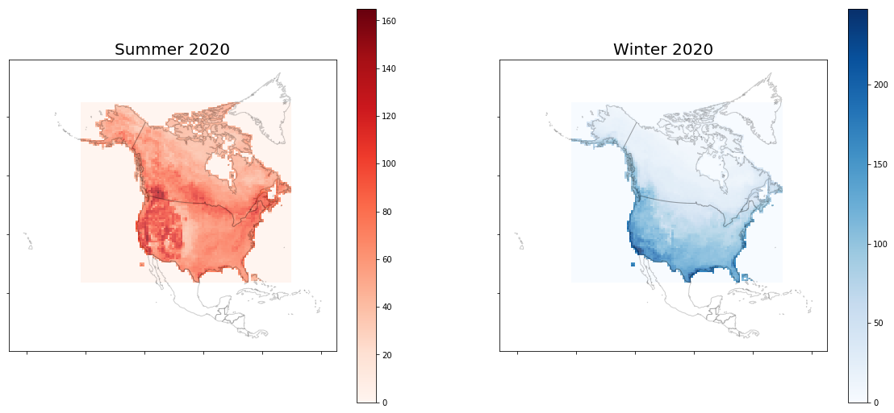
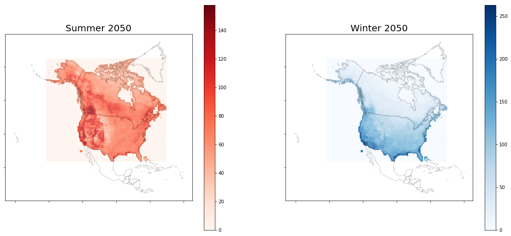
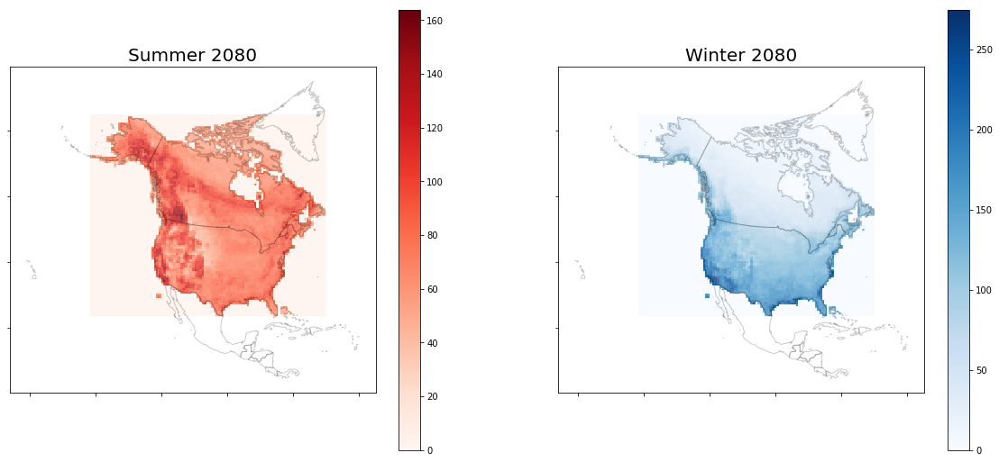

# Mapping Bird Species Density

#### Using Audubon's Birds and Climate Change Report Data and GeoPandas
#### by Brian Brakefield

## Executive Summary

The focus of this project was to examine the change in geographic overlap of species of birds in North America due to climate change. What areas are likely to become habitable to more -or fewer- birds?

My project uses the historic observed data by the Audubon Society's Christmas Bird Counts and Breeding Bird Surveys and the Society's predictions of 616 individual bird species' ranges in North America. The Society provided me with maps for each bird species's range as of the year 2000, and their predictions based upon models informed by the Intergovernmental Panel on Climate Change's (IPCC's) Special Report on Emissions Scenarios (SRES), predicting carbon dioxide and other greenhouse gas levels for the years 2020, 2050, and 2080.

Using Pandas and GeoPandas I created maps for the CBC and BBS bird species separately for each predicted year. By these predictions, we can see that the Alaska Range and Coast Mountains will increasingly become hot spots for summer species, while the lower 48 will become somewhat more uniformly populated by winter species.

## Requirements

- [Pandas](https://pandas.pydata.org/pandas-docs/stable/)
- [GeoPandas](http://geopandas.org/reference.html)
- [Fiona](https://fiona.readthedocs.io/en/latest/)
- [MatPlotLib](https://matplotlib.org/api/_as_gen/matplotlib.pyplot.subplots.html)
- [os](https://docs.python.org/3/library/os.html)
- [NumPy](http://www.numpy.org/)

- [Bird Species Data](https://www.sciencebase.gov/catalog/item/55897deae4b0b6d21dd61c9d)
    - For reproducibility, save all species' data into a folder named `./bird-species`

## Data Format

I'll eschew a typical data dictionary table because large portions of the data are not formatted to be human-interpretable.

### Base Data

[Location](./bird-species) (Once downloaded and populated)

- **geometry** - nested layer containing Shapely MultiPolygon objects nested in 10 or 20 layers
- **layers** - each layer relates to one Emissions Scenario and date, plus the 2000 observed data, for the BBS and/or CBC survey period.

    example:
```
['E00021700_fuwduc_2000_suitability_kappa_BBS',
'E00021700_fuwduc_2020_A1B_suitability_kappa_BBS',
'E00021700_fuwduc_2020_A2_suitability_kappa_BBS',
'E00021700_fuwduc_2020_B2_suitability_kappa_BBS',
'E00021700_fuwduc_2050_A1B_suitability_kappa_BBS',
'E00021700_fuwduc_2050_A2_suitability_kappa_BBS',
'E00021700_fuwduc_2050_B2_suitability_kappa_BBS',
'E00021700_fuwduc_2080_A1B_suitability_kappa_BBS',
'E00021700_fuwduc_2080_A2_suitability_kappa_BBS',
'E00021700_fuwduc_2080_B2_suitability_kappa_BBS']
```

- **CRS** - Coordinate Reference System, an attribute of the geometry for each species. The Audubon's Society is mapped in the Albers Equal Area projection, centered on the United States and Canada:

```
{'proj': 'aea',
'lat_1': 20,
'lat_2': 60,
'lat_0': 40,
'lon_0': -96,
'x_0': 0,
'y_0': 0,
'datum': 'NAD83',
'units': 'm',
'no_defs': True}
```

### Layer-Separated Data

[Location](./birds-data) (once unzipped)
- **geometry** - inherited from the base data, but rather than containing all the layers for a given bird species, the GeoDataFrames in from this stage of processing contain a row for every bird species, each observation containing a single MultiPolygon relating to the Emissions Scenario to which the GeoDataFrame refers.
- **layers** - Each GeoDataFrame relates toa single layer. The ones I selected for my own project are the 2000 historical data and the predictions in the A2 family of predictions. These are pessimistic of future greenhouse gas emissions, assuming that every country acts only in its own interest. I selected for this family of Scenarios because the resulting maps would show large amounts of change and the scenario is at least as likely as any more optimistic ones to come to pass.

### Aggregate GeoDataFrames

[Location](./birds-data) (once unzipped)
- **geometry** - each row represents a square defined in my second notebook. The squares map together to fill the area of the Layer-Separated GeoDataFrames with 99x99 squares.
- **count** - how many species of birds' ranges intersect the defined square.

## Methods

### Notebook 1
1. Read in data using GeoPandas: .gpd.read_file()
2. Performed Exploratory Data Analysis by making some simple maps, examining column and data structure.
3. Formed a list keep_layers of string values for my target layers that I then wanted to isolate into their own GeoDataFrames
4. Created my layer-separated GeoDataFrames, by iterating first over keep_layers, then again over all the bird species data using os.listdir(), then finally each layer using fiona.listlayers() and `[layer string] in [filename.geometry.layer]` logic to separate the layers (each layer also contained the bird species name, so had to be searched to be generally applicable)

### Notebook 2

1. Read in data from notebook 1, performed some EDA on regarding coordinates
2. Set all data coordinate systems to those mentioned above
3. Performed a test run of a 12x12 square map, using steps mentioned above:

    1. used geoDataFrame.bounds.sort_values() to limit the target area bounds, and used np.linspace to create equally-sized squares
    2. read in my map of North America, created at this website and stored locally here
    3. Used `GeoDataFrame.intersects()` and iterated over every species in `sum_00`. Used `sum()` to add the boolean values into the `count` column.
    4. Mapped the "pixels" over the map of North America and the layered polygons of `sum_00`, colored using GeoPandas' built in chloropleth argument in their version of `.plot()`

**Result:**
[!test-map-00](./assets/test-map-00.png)

4. The test being successful, I then performed the same process for every GeoDataFrame created in Notebook 1 on a 99x99-square grid and saved the resulting GeoDataFrame in `./assets/`

#### NOTE: if reproducing this work, bear in mind that this step takes several hours to run

### Notebook 3

1. Read in the data from Notebook 2
2. Read in the NorthAm.json file
3. Followed similar steps to the test case above to map my 99x99 squares over NorthAm using `plt.subplots()`, I created and then saved my output maps as side-by-side, "Summer" and "Winter" maps for each year.

**Results:**








As can be seen, in the future we can expect the trend of large number of bird species ranging near mountain ranges to continue northward, into the Coast Mountains and Alaskan Range. Differences in the winter bird species are less pronounced, but there is a generally larger number of bird species that can be observed inland from the coast compared to current numbers.

## Future Considerations

If I (or others) expand upon this project, consideration will be given to:

- using different software such as Esri ArcMap to test other functions and improve output images
- using cloud computing for the time-intensive processes
- examining other Emissions Scenarios for insights in less-extreme climate change models
- exploring other tools to output interactive maps: a single display that can scroll through the different years, click interaction to show the species count for individual squares

## Special Thanks

To the Audubon Society and particularly my contact Brooke Bateman, PhD, Senior Climate Scientist at the Society, for releasing their data to mefor use in this project.

#### The contents of this project are for purely personal and academic purposes and are not to be used or distributed for any other purpose without the express permission of the Audubon Society
